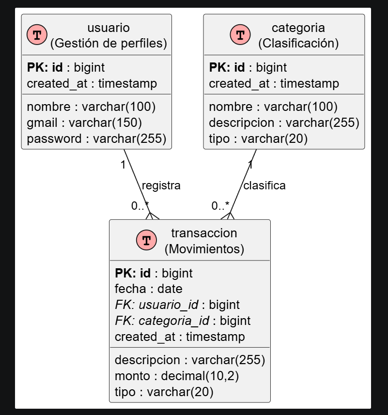

# FinanceFlux — Gestor de Finanzas Personales

[](https://spring.io/projects/spring-boot)
[](https://react.dev/)
[](https://developer.mozilla.org/es/docs/Web/JavaScript)
[](https://tailwindcss.com/)
[](https://www.postgresql.org/)
[](https://www.docker.com/)

**FinanceFlux** es una aplicación web moderna y premium diseñada para la administración integral de finanzas personales. Permite a los usuarios realizar un seguimiento detallado de sus ingresos y gastos, definir y monitorear metas de ahorro, estructurar presupuestos con clasificación inteligente, y visualizar reportes interactivos en tiempo real. 

El sistema incluye funcionalidades avanzadas como **Ahorro Automático (AutoSave)** y una simulación interactiva de **protocolo de transición segura (AES-GCM)** al cambiar o iniciar sesión con diferentes perfiles de usuario.


---

## 🎯 Características Principales

*   **📊 Dashboard Inteligente:** Panel interactivo en tiempo real con balances consolidados (Ingresos totales, Gastos totales, y Saldo disponible) y resúmenes gráficos rápidos.
*   **💸 Control de Transacciones:** Registro completo de movimientos financieros (Ingresos/Gastos) con soporte para autocompletado y creación dinámica de categorías.
*   **🎯 Metas de Ahorro con Aportes:** Creación de metas financieras con porcentaje de cumplimiento visual, fechas límite y la capacidad de abonar fondos directamente desde la interfaz.
*   **🤖 Regla de Ahorro Automático (AutoSave):** Configuración de reglas dinámicas por usuario. Al habilitarse, un porcentaje fijo o un monto específico de cada *ingreso* registrado se redirige automáticamente como gasto a una meta de ahorro predeterminada.
*   **🔒 Transición de Sesión Segura:** Pantalla animada de carga con simulación de encriptación AES-GCM que limpia caché y regenera estados locales de forma segura al cambiar de usuario.
*   **📚 API Autodocumentada con Swagger:** Interfaz interactiva de OpenAPI v3 en el backend para realizar pruebas de los endpoints de manera directa.
*   **🚀 Despliegue con Un Solo Comando:** Configuración Docker y Docker Compose para levantar base de datos, backend y frontend en segundos de manera orquestada.

---

## 🛠️ Stack Tecnológico

### Frontend
*   **Lenguaje:** JavaScript (JSX)
*   **Framework:** React 19 + Vite
*   **Estilos:** Tailwind CSS v4.0 (Glassmorphism & Temas Oscuros)
*   **Animaciones:** Motion (framer-motion) para micro-interacciones suaves
*   **Gráficos:** Recharts (Gráficos interactivos de líneas, barras y donas)
*   **Iconos:** Phosphor Icons & Material Symbols Rounded
*   **Cliente HTTP:** Axios

### Backend
*   **Framework:** Java 21 + Spring Boot 3.4.5
*   **Persistencia:** Spring Data JPA + Hibernate
*   **Base de Datos:** PostgreSQL 15 (Alpine)
*   **Documentación:** Springdoc OpenAPI UI (Swagger)
*   **Utilidades:** Project Lombok & Jakarta Bean Validation

---

## 📂 Estructura del Proyecto

```text

├── backend/                  # API REST (Spring Boot)
│   ├── src/main/java/com/gestorfinanzas/backend/
│   │   ├── config/          # Configuración de CORS y OpenAPI
│   │   ├── controller/      # Controladores REST (Endpoints)
│   │   ├── dto/             # Objetos de Transferencia de Datos (DTOs)
│   │   ├── entity/          # Entidades JPA (Mapeo de base de datos)
│   │   ├── repository/      # Repositorios de Spring Data JPA
│   │   └── service/         # Interfaces y Lógica de Negocio
│   ├── src/main/resources/
│   │   ├── application.properties  # Propiedades de Spring Boot
│   │   ├── schema.sql       # Estructura inicial de la Base de Datos
│   │   └── data.sql         # Datos de prueba (Seeding)
│   ├── Dockerfile            # Construcción de contenedor Backend
│   └── pom.xml               # Dependencias de Maven
│
├── frontend/                 # Aplicación Web (React + Vite)
│   ├── src/
│   │   ├── components/      # Componentes reutilizables (UI, Layouts)
│   │   ├── context/         # Proveedor del Estado Global (FinanceContext)
│   │   ├── lib/             # Cliente Axios y utilidades
│   │   ├── pages/           # Vistas (Dashboard, Transactions, Goals, Reports)
│   │   ├── App.jsx          # Enrutamiento y control de transiciones
│   │   └── main.jsx         # Punto de entrada de React
│   ├── Dockerfile            # Construcción de contenedor Frontend
│   ├── nginx.conf            # Servidor web Nginx de producción para la SPA
│   └── package.json          # Dependencias y scripts de Node
│
├── docs/                     # Diagramas e historial de comprobación de APIs
├── docker-compose.yml        # Orquestación de contenedores Docker
└── .env                      # Variables de entorno globales (Ignorado en producción)
```

---

## 📊 Diagrama Entidad-Relación (DER)

El diseño de la base de datos está estructurado para soportar la integridad de los datos financieros, las relaciones entre usuarios, sus transacciones, categorías personalizadas y sus metas de ahorro:



*Nota: El archivo de diseño original (`DiagramaER.wsd`) y la imagen se encuentran en la carpeta [database/](file:///c:/Users/i5/Desktop/Gestor_finanzas/Gestor_finanzas-main/database) de este repositorio.*

---

## 🔑 Credenciales de Prueba (Desarrolladores)

El sistema viene precargado con 5 perfiles de desarrolladores para facilitar la exploración de datos históricos:

| Nombre Completo | Correo Electrónico (Gmail) | Contraseña | Género |
| :--- | :--- | :--- | :--- |
| **Alisson Patricia Barillas Castillo** | `BC24013@ues.edu.sv` | `K7mN9pQr` | Femenino |
| **Oscar Miguel Herrera Valladares** | `HV22011@ues.edu.sv` | `w2xY5zAb` | Masculino |
| **Franklin Esteban Perez Fuentes** | `PF24001@ues.edu.sv` | `cD4eF6gH` | Masculino |
| **Héctor Danilo Benítez Ortéz** | `BO16004@ues.edu.sv` | `iJ8kL0mN` | Masculino |
| **Jonás Eduardo Villalobos Morán** | `VM24042@ues.edu.sv` | `oP3qR5sT` | Masculino |

*Nota: También es posible crear cuentas nuevas directamente desde el formulario de registro en la pantalla de inicio de sesión.*

---

## 🚀 Guía de Ejecución Paso a Paso

### Prerrequisitos
Asegúrate de tener instalado:
*   [Git](https://git-scm.com/)
*   [Docker Desktop](https://www.docker.com/products/docker-desktop/) (Recomendado para la Opción A)
*   **O si deseas ejecutarlo de forma manual (Opción B):**
    *   [Java JDK 21](https://adoptium.net/temurin/releases/?version=21)
    *   [Node.js v18+](https://nodejs.org/)
    *   [PostgreSQL 15+](https://www.postgresql.org/download/)

---

### Opción A: Ejecución con Docker (Recomendado)

Esta opción levanta automáticamente la base de datos PostgreSQL, compila el backend de Java, genera el build estático del frontend y lo expone a través de un servidor Nginx con redirección de rutas SPA.

#### 1. Preparar las Variables de Entorno
Crea un archivo llamado `.env` en la raíz del proyecto (junto a `docker-compose.yml`). Puedes usar los siguientes valores predeterminados:
```env
# Configuración de base de datos PostgreSQL
POSTGRES_DB=finanzas_bd
POSTGRES_USER=financeflux
POSTGRES_PASSWORD=Fx9#m2W!
```

#### 2. Levantar la Aplicación
Abre una terminal en la raíz del proyecto y ejecuta:
```bash
docker-compose up --build -d
```
Este comando:
*   Creará el contenedor de la base de datos e inicializará el esquema.
*   Compilará el código de Spring Boot usando una imagen Maven y levantará la API en el puerto `8081`.
*   Compilará el frontend con Vite y levantará el servidor web Nginx expuesto en el puerto `3000`.

#### 3. Acceder a los Servicios
*   **Frontend (Panel de usuario):** [http://localhost:3000](http://localhost:3000)
*   **Documentación de API (Swagger):** [http://localhost:8081/swagger-ui/index.html](http://localhost:8081/swagger-ui/index.html)

#### 4. Detener el Entorno
Para apagar los contenedores conservando los datos:
```bash
docker-compose down
```
Si deseas apagar los contenedores y **borrar** todos los datos guardados en la base de datos (para reiniciar el seeding):
```bash
docker-compose down -v
```

---

### Opción B: Ejecución Manual (Local)

Si prefieres ejecutar el código directamente en tu sistema operativo para depurar, sigue estos pasos:

#### Paso 1: Configurar la Base de Datos
1. Inicia tu servicio de **PostgreSQL** local.
2. Abre tu gestor de base de datos (pgAdmin, DBeaver, psql) y crea una base de datos llamada `finanzas_bd`.
3. Crea un usuario/rol llamado `financeflux` con la contraseña `Fx9#m2W!` y dale permisos sobre la base de datos.
*(Nota: Si usas credenciales distintas, modifícalas en el archivo [application.properties](backend/src/main/resources/application.properties)).*

#### Paso 2: Ejecutar el Backend
1. Abre una terminal y navega al directorio del backend:
   ```bash
   cd backend
   ```
2. Ejecuta la aplicación usando el wrapper de Maven suministrado:
   *   **En Windows:**
       ```cmd
       mvnw.cmd spring-boot:run
       ```
   *   **En Linux/macOS:**
       ```bash
       chmod +x mvnw
       ./mvnw spring-boot:run
       ```
3. El backend compilará, creará las tablas, cargará el archivo `data.sql` y arrancará en el puerto `8081`. Puedes comprobar el estado ingresando a: [http://localhost:8081/swagger-ui/index.html](http://localhost:8081/swagger-ui/index.html).

#### Paso 3: Ejecutar el Frontend
1. Abre una nueva terminal y navega al directorio del frontend:
   ```bash
   cd frontend
   ```
2. Instala las dependencias necesarias de Node:
   ```bash
   npm install
   ```
3. Ejecuta el servidor de desarrollo de Vite:
   ```bash
   npm run dev
   ```
4. Abre tu navegador e ingresa a: [http://localhost:3000](http://localhost:3000).

---

## 📡 Endpoints Clave de la API (Backend)

La API REST del backend cuenta con las siguientes rutas de servicio bajo el prefijo `/api`:

| Categoría | Método | Ruta | Descripción |
| :--- | :--- | :--- | :--- |
| **Usuarios** | `POST` | `/api/usuarios` | Registra un nuevo usuario en la app. |
| | `POST` | `/api/usuarios/login` | Autentica a un usuario y retorna su perfil. |
| | `GET` | `/api/usuarios` | Lista todos los usuarios registrados. |
| | `DELETE` | `/api/usuarios/{id}` | Elimina un usuario por su identificador. |
| **Categorías**| `GET` | `/api/categorias` | Obtiene la lista de categorías (Ingresos/Gastos). |
| | `POST` | `/api/categorias` | Crea una categoría dinámica de transacciones. |
| **Metas** | `GET` | `/api/metas?usuarioId={id}`| Lista las metas de ahorro de un usuario específico. |
| | `POST` | `/api/metas` | Registra una nueva meta de ahorro. |
| | `PATCH`| `/api/metas/{id}/fondos` | Suma fondos acumulados a una meta de ahorro. |
| **Movimientos**| `GET` | `/api/transacciones?usuarioId={id}` | Lista todas las transacciones de un usuario. |
| | `POST` | `/api/transacciones` | Crea una nueva transacción (Ingreso/Gasto). |
| | `PUT` | `/api/transacciones/{id}`| Actualiza los campos de una transacción. |
| | `DELETE`| `/api/transacciones/{id}`| Elimina la transacción seleccionada. |
---

## 📸 Evidencias de Funcionamiento

### 1. Documentación de API (Swagger UI)
El backend está auto-documentado con Swagger, facilitando la visualización e interacción con cada uno de los endpoints de la API.

*   **Punto de entrada de la documentación:**
    

*   **Ejemplo de Listado (GET):**
    

*   **Ejemplo de Registro (POST):**
    

*   **Ejemplo de Modificación (PUT):**
    

*   **Ejemplo de Eliminación (DELETE):**
   


*Nota: Puedes ver más detalles y capturas de prueba específicas en la carpeta [docs/evidencias_swagger/](file:///c:/Users/i5/Desktop/Gestor_finanzas/Gestor_finanzas-main/docs/evidencias_swagger).*

### 2. Capturas de las Vistas del Frontend
A continuación se presentan capturas de pantalla de la interfaz del usuario. 

*   **Pantalla de Login:**
    

*   **Dashboard Principal:**
    

*   **Gestión de Transacciones:**
    

*   **Metas de Ahorro:**
    

*   **Reportes:**
    


---

## 👥 Equipo de Desarrollo

*   **Alisson Patricia Barillas Castillo** (BC24013)
*   **Oscar Miguel Herrera Valladares** (HV22011)
*   **Franklin Esteban Perez Fuentes** (PF24001)
*   **Héctor Danilo Benítez Ortéz** (BO16004)
*   **Jonás Eduardo Villalobos Morán** (VM24042)

---
